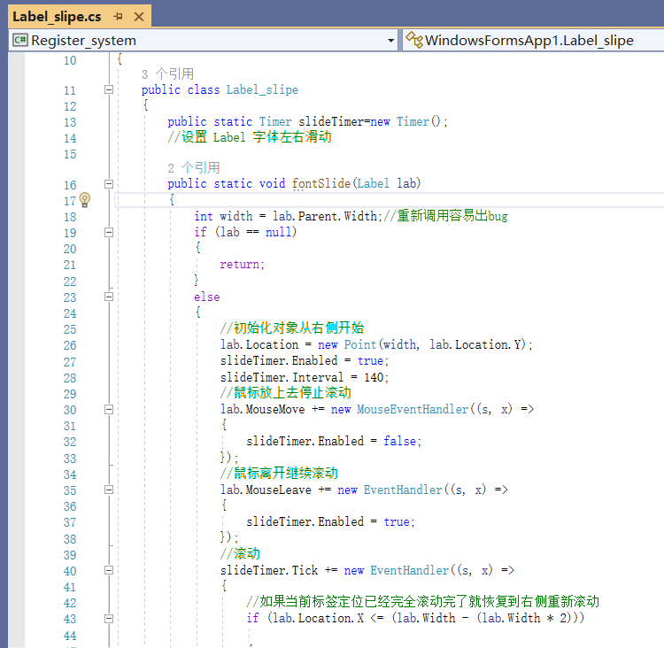

# 项目介绍

本项目是作者在大学期间一个核心课医院信息系统HIS的课设作业，一个桌面移动窗口软件，前后历时了半个学期，从0到1独自完成，也算是认真打磨了一下，该课最后期末95+，rank 1，开源分享一下项目源码(包含mysql数据库表)。

实现功能:挂号，统计查询，退号，排班，叫号，开病例，医师注册等功能

编译器:Visual Studio 2022 IDE

编译语言:C#.net

数据库:Mysql

具体使用和实现功能细节可以观看：演示视频.mp4
# **运行界面说明**

展示视频中有具体细节。

一共两个公共调用方法类，分别提供了滑动字体功能和连接数据库功能。

一共九个窗口，分别是用户注册界面,登陆界面,系统主界面,挂号界面,查询统计/退号界面,医师注册界面,医生排班界面,叫号界面,病例病嘱界面等。

## **两个公共方法类**

1.  **连接数据库类**

类名Mysql,使用的是mysql，本地数据库账号和密码如上，数据库名称为net

****

2.  **滑动字体类**

类名Label_slipe，实现功能为窗体label字体滑动出现。

****

## **九个窗体**

1.  **登陆界面**

输入用户账号和密码进入，不能为空，账号密码错误会报错提示。

账号和密码存在本地数据库。

账号:12345

密码:12345

2.  **用户注册界面**

账户密码不能为空，两次密码必须一致。

若数据库已存在相同账号，不可注册。

3.  **系统主界面**

进入系统后，登陆界面将会关闭。

各个功能的集成主界面。

4.  **挂号界面**

新注册的单号为max(数据库中单号)+1，挂号日期默认为当前时间。

根据挂号日期和挂号时间段的不同，可选择的看病医师也有所不同。

根据选择的看病医师职位，挂号费用将会有所改变。医师20元，主任医师40元。

5.  **统计查询/退号界面**

挂号统计查询，可根据挂号单的起止时间，单号，患者姓名，医师id等多个条件查询。

Ctril/shift可选中单号或多行进行退号删除，将会再次提醒确认删除，并从数据库中删除。

6.  **医生注册界面**

新注册医生id号为max(数据库中医生id)+1

7.  **医生排班系统**

根据星期排班，每星期分为了早班和午班。

排班表里1为值班，0为不值班，删除排班即将1改为0。

可以根据星期几，早班/晚班，定向查询值班医生有哪些，也可以查询所有早班/晚班。

8.  **叫号系统**

根据先进先出队列叫号，接诊结束即换下个人。

没有人时，将无法叫号/开病例。

9.  **病例病嘱界面**

病历采用了rtf实现,默认保存名为单号+患者姓名的rtf文件，可以打开之前开的所有病历。

采用的路径为压缩文件的相对路径。

默认打开了相对路径下的 **"..\\\\..\\\\Diagnose_lists\\\\模板.rtf"**

病历将会根据数据库中单号的患者姓名,性别,年龄,单号,接诊时间,科室自动填充到病历上。

点击打开按钮的路径为 **:"..\\\\..\\\\Diagnose_lists"** ，可查看之前rtf病历。

插入图片可插入医师各自的电子签名，格式为jpg。

默认保存到:**\$("..\\\\..\\\\Diagnose_lists\\\\{id}_{name}.rtf")** ;

疾病和药品病嘱可以进行模糊搜索，疾病根据ICD编码或者名称都可搜索到，点击插入即可插入到光标相应位置。

****

# **表结构说明文档**

数据库net一共七个表，表:login,doctors,lists,morning,evening,icd10,medicines。

分别储存了登陆用户数据，医生数据，挂号单数据，晨班和午班的医生排班数据，疾病ICD-10编码数据，药品数据。

使用的是mysql，数据库信息如下。

1.  **用户登陆表**

表名:login，存储登陆用户的账号密码。

| 序号 | 字段名    | 字段描述 | 数据类型 | 长度 | 为空 | 注释 | 默认 |
|------|-----------|----------|----------|------|------|------|------|
| 1    | user_id   | 登陆账号 | INT(11)  | 11   | N    | PK   |      |
| 2    | user_pasw | 登陆密码 | INT(11)  | 11   | Y    |      | 0    |

  

2.  **医师信息表**

表名:doctors,存储医师信息。

医师费用为20元，主任医生的费用为40元。

| 序号 | 字段名       | 字段描述 | 数据类型    | 长度 | 为空 | 注释 | 默认         |
|------|--------------|----------|-------------|------|------|------|--------------|
| 1    | doc_id       | 医师号   | INT(11)     | 11   | N    | PK   |              |
| 2    | doc_name     | 姓名     | VARCHAR(15) | 15   | N    |      |              |
| 3    | doc_cost     | 会诊费用 | DOUBLE      |      | Y    |      | 0            |
| 4    | doc_office   | 所在科室 | VARCHAR(45) | 45   | Y    |      | '无'         |
| 5    | doc_birthday | 生日     | DATE        |      | Y    |      | '0000-00-00' |
| 6    | doc_position | 职位     | VARCHAR(45) | 45   | Y    |      | '医师'       |

3.  **挂号单信息表**

表名:lists,存储挂号单。

主键为list_id,非空，int型。

外键doc_id,约束于doctors表的主键doc_id。

| 序号 | 字段名       | 字段描述   | 数据类型    | 长度 | 为空 | 注释        | 默认              |
|------|--------------|------------|-------------|------|------|-------------|-------------------|
| 1    | list_id      | 单号       | INT(32)     | 32   | N    | PK          |                   |
| 2    | doc_id       | 会诊医师号 | INT(11)     | 11   | N    | Foreign key |                   |
| 3    | list_cost    | 挂单费用   | INT(11)     | 11   | Y    |             | 0                 |
| 4    | patient_name | 患者姓名   | VARCHAR(16) | 16   | N    |             |                   |
| 5    | patient_sex  | 患者性别   | VARCHAR(16) | 16   | Y    |             | NULL              |
| 6    | patient_old  | 患者年龄   | INT(11)     | 11   | Y    |             | NULL              |
| 7    | doc_offic    | 科室       | VARCHAR(45) | 45   | Y    |             | NULL              |
| 8    | check_way    | 支付方式   | VARCHAR(45) | 45   | Y    |             | NULL              |
| 9    | list_date    | 挂号日期   | TIMESTAMP   |      | Y    |             | CURRENT_ TIMESTAMP |

4.  **早班排班表**

表名:morning,存储了每周科室晨班的值班医生，1为值班，0为不值班。

主键为doc_id,非空，int型。

外键为doc_id,约束于doctors表的主键doc_id。

| 序号 | 字段名    | 字段描述   | 数据类型 | 长度 | 为空 | 注释   | 默认 |
|------|-----------|------------|----------|------|------|--------|------|
| 1    | doc_id    | 值班医师号 | INT(11)  | 11   | N    | PK，FK |      |
| 2    | Monday    | 星期一     | INT(11)  | 11   | Y    |        | NULL |
| 3    | Tuesday   | 星期二     | INT(11)  | 11   | Y    |        | NULL |
| 4    | Thursday  | 星期三     | INT(11)  | 11   | Y    |        | NULL |
| 5    | Wednesday | 星期四     | INT(11)  | 11   | Y    |        | NULL |
| 6    | Friday    | 星期五     | INT(11)  | 11   | Y    |        | NULL |
| 7    | Saturday  | 星期六     | INT(11)  | 11   | Y    |        | NULL |
| 8    | Sunday    | 星期日     | INT(11)  | 11   | Y    |        | NULL |
|      |           |            |          |      |      |        |      |

5.  **晚班排班表**

表名:evening,表存储了每周科室午班的值班医生，1为值班，0为不值班。

主键为doc_id,非空，int型。

外键为doc_id,约束于doctors表的主键doc_id。

| 序号 | 字段名    | 字段描述   | 数据类型 | 长度 | 为空 | 注释   | 默认 |
|------|-----------|------------|----------|------|------|--------|------|
| 1    | doc_id    | 值班医师号 | INT(11)  | 11   | N    | PK，FK |      |
| 2    | Monday    | 星期一     | INT(11)  | 11   | Y    |        | NULL |
| 3    | Tuesday   | 星期二     | INT(11)  | 11   | Y    |        | NULL |
| 4    | Thursday  | 星期三     | INT(11)  | 11   | Y    |        | NULL |
| 5    | Wednesday | 星期四     | INT(11)  | 11   | Y    |        | NULL |
| 6    | Friday    | 星期五     | INT(11)  | 11   | Y    |        | NULL |
| 7    | Saturday  | 星期六     | INT(11)  | 11   | Y    |        | NULL |
| 8    | Sunday    | 星期日     | INT(11)  | 11   | Y    |        | NULL |

6.  **疾病ICD-10表**

表名:icd10,表存储了各疾病的ICD-10的编码和名称。

| 序号 | 字段名 | 字段描述 | 数据类型    | 长度 | 为空 | 注释 | 默认 |
|------|--------|----------|-------------|------|------|------|------|
| 1    | id     | 疾病编码 | VARCHAR(45) | 45   | N    | PK   |      |
| 2    | name   | 疾病名称 | VARCHAR(45) | 45   | Y    |      | 无   |

7.  **药品表**

表名:medicines,表存储了各药品的信息。

| 序号 | 字段名  | 字段描述 | 数据类型    | 长度 | 为空 | 注释 | 默认 |
|------|---------|----------|-------------|------|------|------|------|
| 1    | id      | 药品编码 | VARCHAR(45) | 45   | N    | PK   |      |
| 2    | name    | 药品名称 | VARCHAR(45) | 45   | Y    |      | 无   |
| 3    | unit    | 规格单位 | VARCHAR(45) | 45   | Y    |      | NULL |
| 4    | scale   | 大小     | VARCHAR(45) | 45   | Y    |      | NULL |
| 5    | product | 生产公司 | VARCHAR(45) | 45   | Y    |      | NULL |

# **综上，感谢阅读，新手见谅！**
# **若有相关问题可邮箱咨询:862700320@qq.com**
